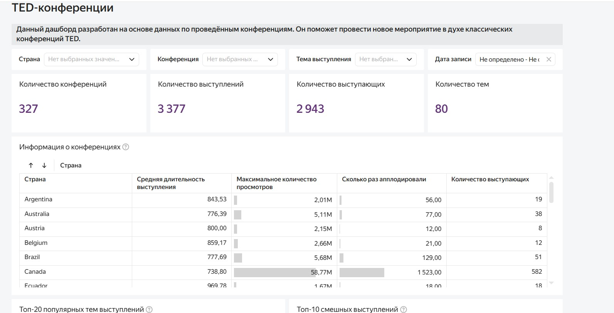

# Проект Создание дашборда TED-конференций
## Бизнес-контекст 
В аналитическое агентство обратилась компания, которая приобрела лицензию на проведение конференций TED (Популярные мероприятия, в рамках которых люди читают лекции на разные темы: наука, искусство, бизнес, психология и так далее. Участниками конференций часто становятся известные личности, например: нобелевские лауреаты, политики, бизнесмены.). Сейчас идёт этап организации первого мероприятия: заказчик ищет выступающих, подбирает темы и площадки. Компании важно провести мероприятие в духе классических конференций TED и сделать это так, чтобы оно было запоминающимся и интересным. Для этого заказчик хочет учитывать опыт проведённых конференций и просит разработать дашборд, который в этом поможет.
## Цель проекта - разработать дашборд, который помжет ответить заказчику на следующие вопросы:
- Какие темы популярны? Как зрители реагируют на них?
- Какое среднее количество выступающих на одной конференции?
- Какая средняя длина выступления? Как правильно организовать время проведения конференции?
- Кто из выступающих интересен зрителям?
## Задачи
- Изучить датасет на верхнем уровне. Добавить показатели, которые помогут заказчику понять, на каком объёме данных строится дашборд и можно ли на них опираться.
- Подробнее изучить конференции. У пользователя должна быть возможность сделать детализацию от страны к конференциям и увидеть такие показатели:
средняя длительность выступления; максимальное количество просмотров, которое было у выступления; сколько раз аплодировали за всю конференцию; количество выступающих.
- Исследовать выступления: топ-10 самых смешных выступлений, топ-20 самых популярных тегов.
- Узнать о выступающих. Чем занимаются выступающие (род их деятельности), которым аплодируют больше всего.
Если пользователь найдёт интересный факт или инсайт, у него должна быть возможность в деталях увидеть информацию о каждом выступлении.

Основной инструмент - `Yandex DataLens`.

